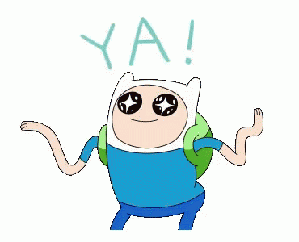

<p align="center">
    <a></a>
</p>

# RPG - Time to create a role-playing game

- **Binary name:** rpg
- **Language:** C
- **Compilation:** Make

# Subject

The aim of the RPG is to implement a role-playing game.

Making an enjoyable game is just as important as writing clean code.
A working game which is no fun to play is pointless!

> :speaking_head: Let’s be honest. Implementing a video game is generally not fun (at least not all the time). But it can be, and having someone else enjoy a game you made is an amazing feeling. The result will be worth the effort, so do your best! And most importantly, have fun.

## Prerequisites

What you need

```
C Library
gcc
Graphics Library
CSFML
make
```

## Compiling

Clone the repository and go inside. Then,

```
$ make re
```

## Usage

```
∼/> ./rpg
```

## GAME

<p align="center">
    <a></a>
</p>

> :speaking_head: We had to hit this project
